

<h1 align="center">WealthPilot for macOS</h1>

<b>Personal finance, savings, investing, tax and retirement planning — private, on-device, with Apple Intelligence.</b>

WealthPilot turns your paycheck, rent, expenses, debts, savings and investments into one clear plan: where your money goes, where you can save, what you'll pay in taxes, and whether you're on track to retire. Everything is computed **on your device** — no accounts, no servers, no tracking. Optional **iCloud sync** keeps your iPhone, iPad and Mac in step through your private iCloud database.

> Also available for iOS: [investments_ios_docs](https://github.com/giridharmb/investments_ios_docs)

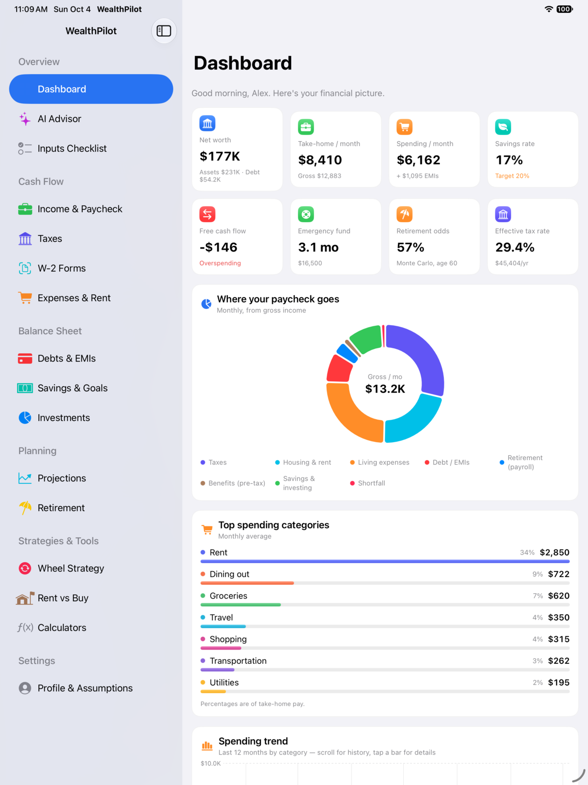

## Highlights

| | |
|---|---|
| 📊 **Dashboard** | Net worth, take-home pay, spending, savings rate, emergency-fund months, retirement odds and effective tax rate at a glance. |
| 💼 **Paycheck** | Gross → 401(k)/pension → health/HSA → taxes → net, per paycheck. Employer-match gap detection. |
| 🏛 **Taxes** | 2026 US federal brackets, FICA, all 50 states + DC (approx.), child tax credit; simplified national systems for India, UK, Canada, Germany, Australia, Singapore, UAE and Japan. |
| 🧾 **W-2 import** | Scan a W-2 (PDF or image file, or Photos). Vision OCR + on-device AI extract the boxes; you review before saving. Predicts refund or amount owed. |
| 🏠 **Expenses & Rent** | 22 categories, recurring and one-off spending, rent affordability (30% rule), state median-rent comparison, 50/30/20 check. |
| 💳 **Debts & EMIs** | EMI calculation, amortization charts, Avalanche vs Snowball payoff with extra-payment slider. |
| 🐷 **Savings & Goals** | Emergency fund, high-yield optimization, goals with the monthly amount needed. |
| 📈 **Investments** | Allocation vs an age/risk glide path, expected return, volatility, risk score, fee drag, “where should my next dollar go” ladder. |
| 🔮 **Projections** | Deterministic + 1,000-path Monte Carlo fan charts, FI age, sustainable spending, what-if sliders. |
| 🏖 **Retirement** | Readiness gauge, income by source, withdrawal strategies (4% rule, Guardrails, percent-of-portfolio, floor & ceiling), bucket strategy. |
| 🔁 **Wheel strategy** | Cash-secured puts → covered calls, Black-Scholes premiums, Monte Carlo vs buy-and-hold, options-income sleeve for retirement. |
| 🏡 **Rent vs Buy** | Net worth comparison with breakeven year. |
| 🧮 **Calculators** | Loan/EMI with prepayment, SIP/compound with step-up, inflation, FIRE. |
| ✨ **AI Advisor** | Ask questions about *your* numbers using Apple's on-device Foundation Models. Falls back to rule-based analysis when unavailable. |
| 👥 **Profiles** | Multiple independent plans — “Default” plus any number you create (blank, copied, or sample). Rename, restyle, duplicate, export, delete, and compare results side by side. |
| ☁️ **iCloud sync & settings** | Optional sync across devices, Face ID / Touch ID app lock, privacy mode that masks amounts, reminders, JSON backup/restore and CSV export. |
| ✅ **Inputs checklist** | Shows which inputs are required, recommended or optional — and what each one unlocks. |

## Screenshots

Screenshots are from the iPad build; the macOS app uses the same sidebar layout and screens.

| Projections | Wheel strategy | Retirement |
|---|---|---|
| 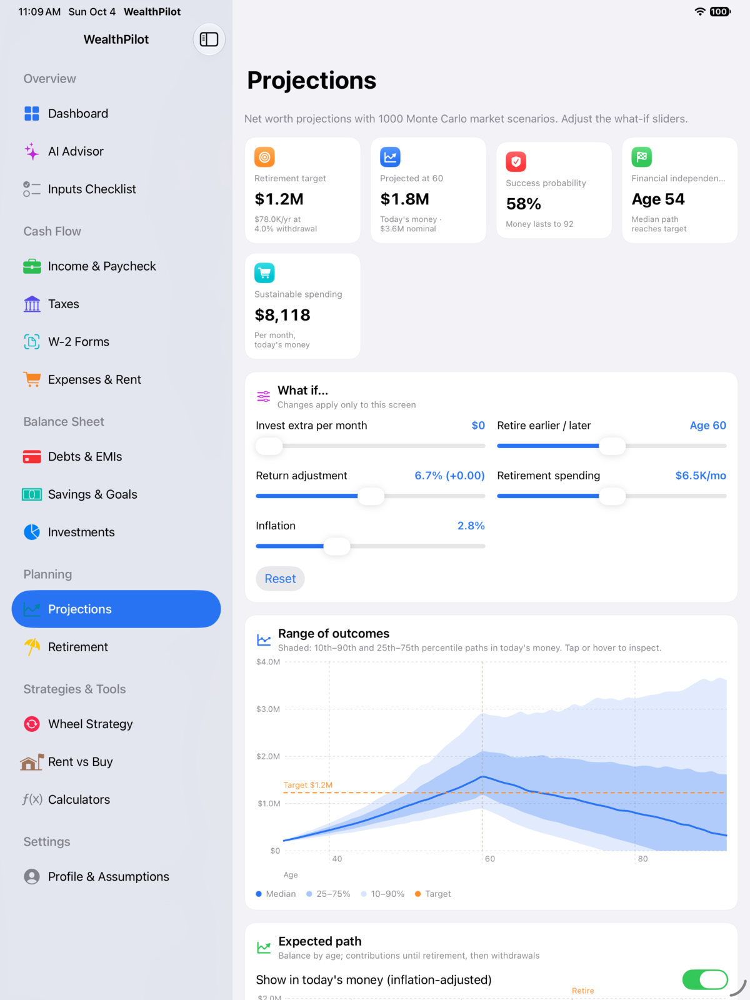 | 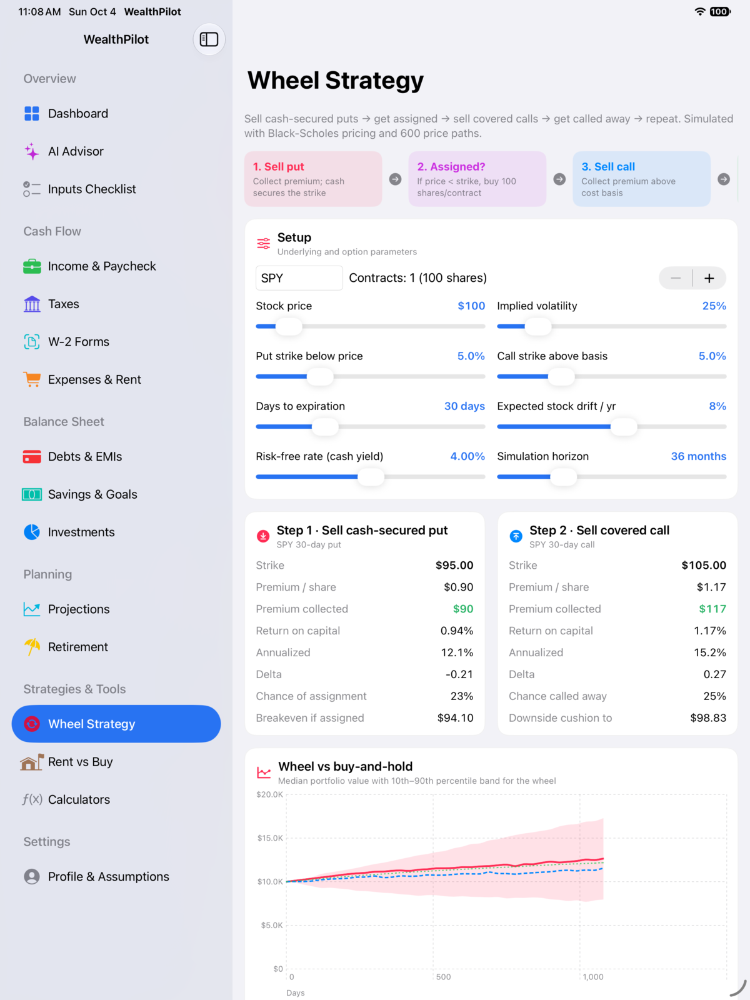 | 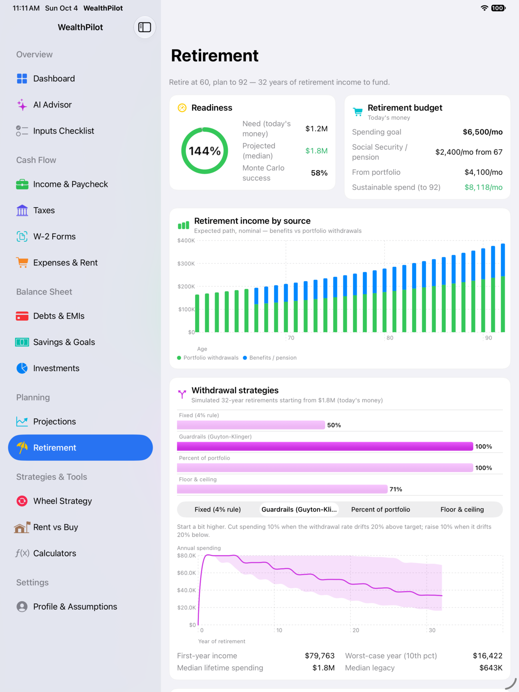 |
| **Expenses & Rent** | **Taxes** | **Debts & EMIs** |
| 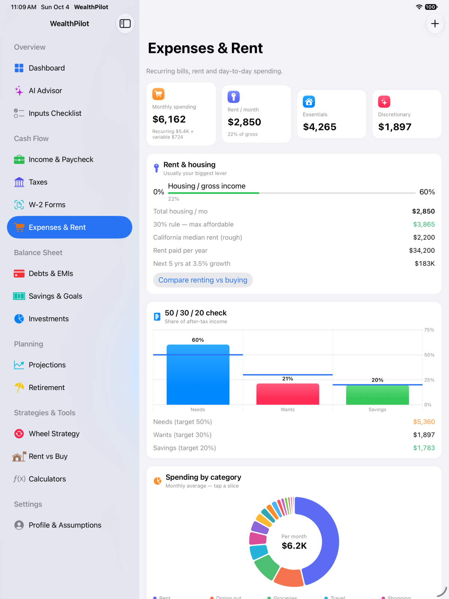 | 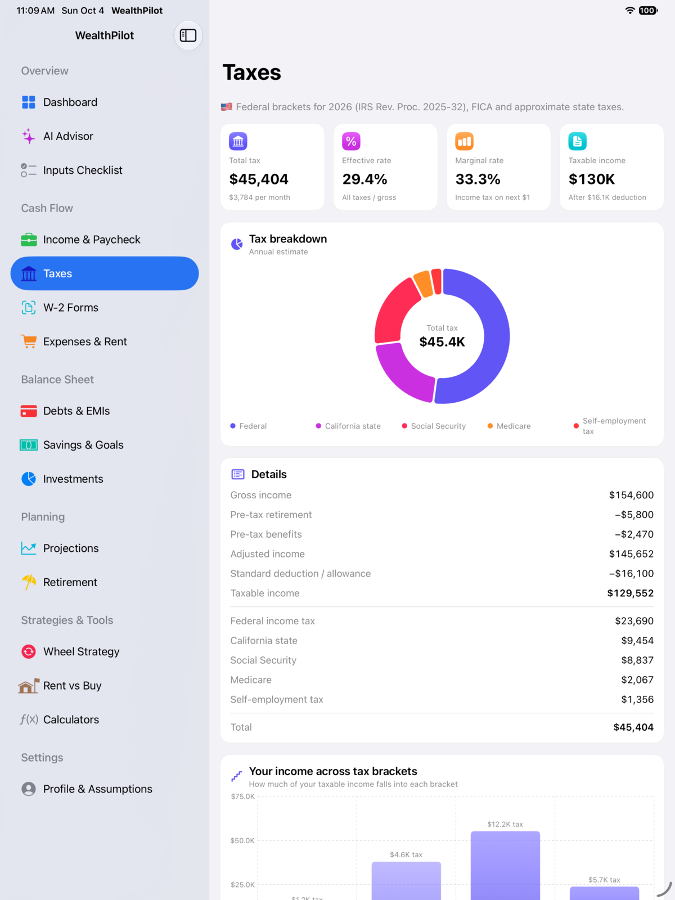 | 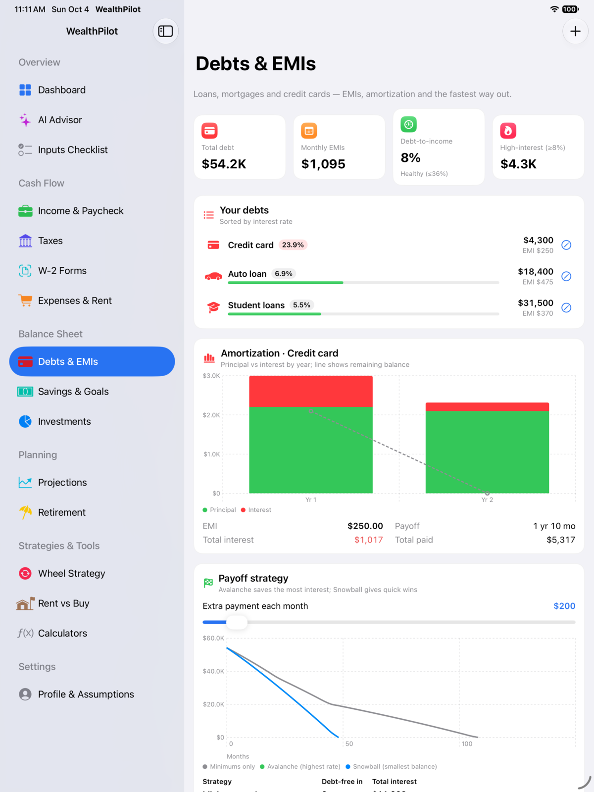 |
| **Investments** | **AI Advisor** | **Rent vs Buy** |
| 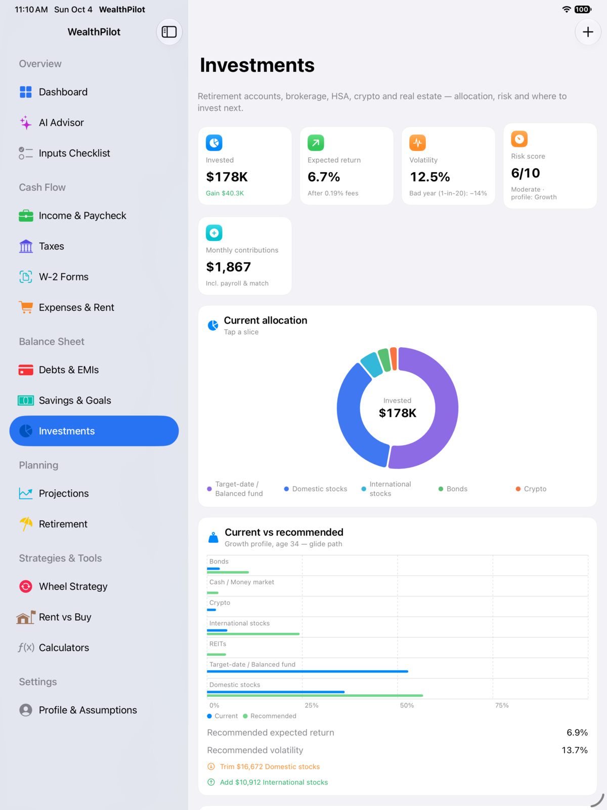 |  | 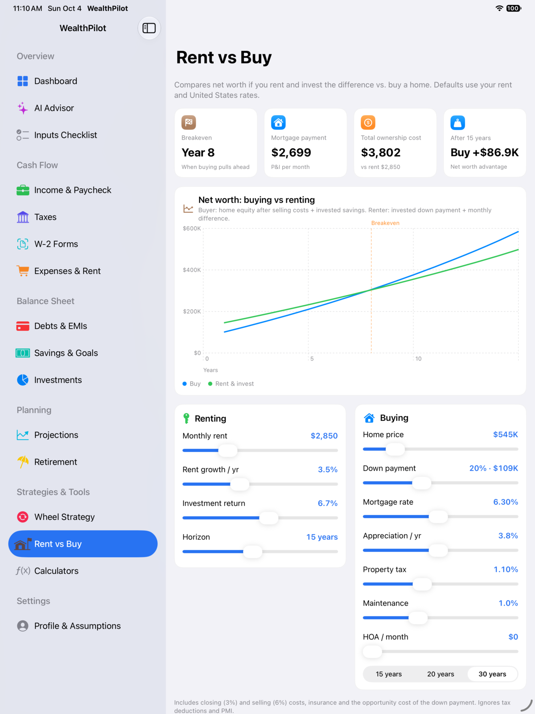 |
| **Settings & iCloud** | **Profiles** | |
| 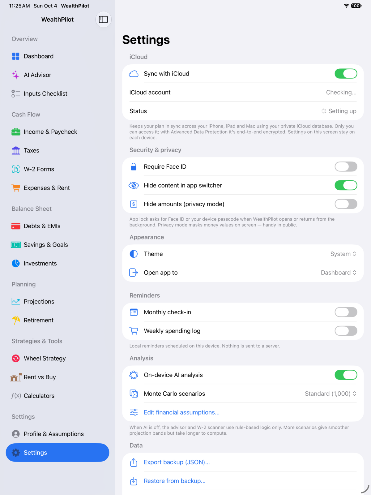 | 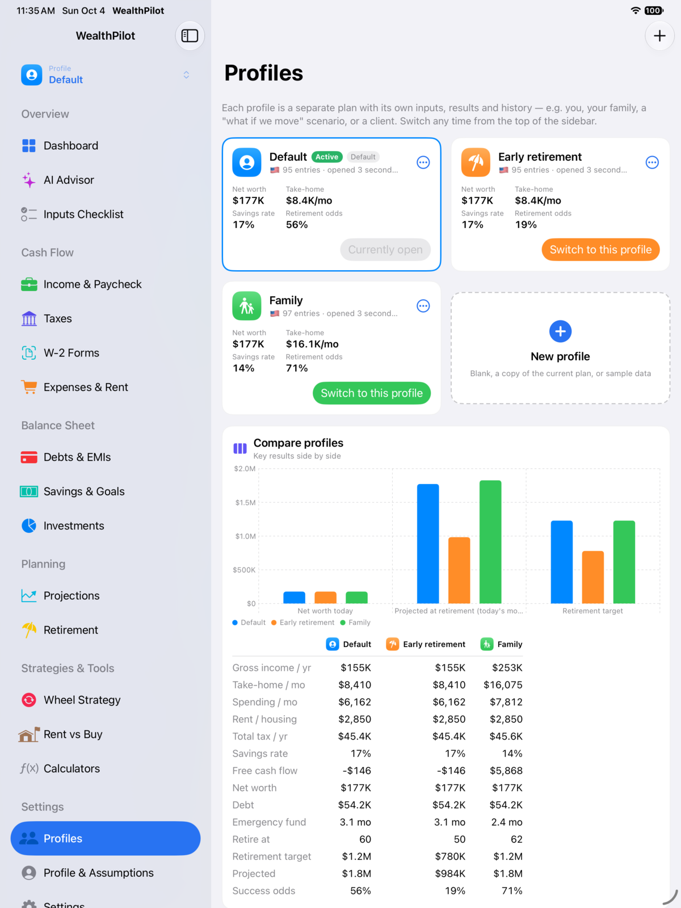 | |

## Requirements

- macOS 26 (Tahoe) or later on Apple silicon / Intel
- On-device AI features need a Mac with Apple silicon and Apple Intelligence enabled. Everything else works on any supported device.

## Documentation

- [User guide](GUIDE.md) — every screen explained
- [Methodology & assumptions](METHODOLOGY.md) — formulas, tax tables, data sources
- [Privacy policy](PRIVACY.md)
- [Support & FAQ](SUPPORT.md)
- [Release notes](CHANGELOG.md)

## Disclaimer

WealthPilot provides educational estimates and planning tools. It is **not** financial, investment, tax or legal advice, and the developer is not a licensed advisor. Tax rules are simplified; market simulations are hypothetical. Consult qualified professionals before making financial decisions.
